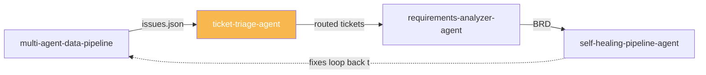
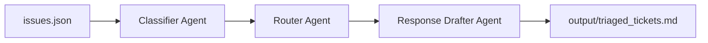

# Ticket Triage Agent

[](https://github.com/Ravitejap25/ticket-triage-agent/actions)
[](https://www.python.org/)
[](https://www.crewai.com/)

> **Part of the [Business Ops Agent Suite](#business-ops-agent-suite)** — Stage 2: Triage.
> Upstream: [multi-agent-data-pipeline](https://github.com/Ravitejap25/multi-agent-data-pipeline)

A 3-agent pipeline that takes raw data-quality issues (from any upstream source) and **classifies severity, routes to the correct team, and drafts a first-response ticket** — automating the triage step that normally eats an analyst's morning.

## Business Ops Agent Suite

This repo is one stage in a connected suite of agents that mirrors a real operational workflow:



Each stage is an **independent repo** that can run standalone — they connect through a shared, documented data contract rather than shared code. See [`ISSUE_SCHEMA.md`](./ISSUE_SCHEMA.md) for the exact interface.

| Stage | Repo | Role |
|---|---|---|
| 1. Intake | `multi-agent-data-pipeline` | Extract, validate, and report on raw business data |
| **2. Triage** | **`ticket-triage-agent`** (this repo) | Classify and route flagged issues |
| 3. Analyze | `requirements-analyzer-agent` *(coming soon)* | Turn triaged issues into structured requirements |
| 4. Resolve | `self-healing-pipeline-agent` *(coming soon)* | Diagnose and fix root causes, closing the loop |

## Architecture (this repo)



| Agent | Responsibility |
|---|---|
| **Classifier** | Assigns real severity (Critical/High/Medium/Low) based on business impact, not just the upstream hint |
| **Router** | Assigns the owning team: Data Engineering, Finance, Sales Ops, or Data Quality |
| **Response Drafter** | Writes a short first-response note per ticket and compiles the final report |

## Getting Started

```bash
git clone https://github.com/Ravitejap25/ticket-triage-agent.git
cd ticket-triage-agent
python -m venv venv
source venv/bin/activate      # Windows: venv\Scripts\activate
pip install -r requirements.txt
cp .env.example .env          # add your OPENAI_API_KEY
python main.py
```

Output lands in `output/triaged_tickets.md`.

### Run tests
```bash
pytest tests/ -v
```

## Connecting to the Data Pipeline

`data/issues.json` in this repo is a **sample** file matching the shape that
`multi-agent-data-pipeline`'s Validator Agent would emit. To wire the two
repos together for real:

1. In `multi-agent-data-pipeline`, add a tool that serializes validation
   findings into the schema described in [`ISSUE_SCHEMA.md`](./ISSUE_SCHEMA.md)
   and writes `output/issues.json`.
2. Copy (or symlink, or pass via shared storage/S3/API) that file into this
   repo's `data/issues.json`.
3. Run `python main.py` here as normal.

This loose coupling — a documented schema instead of shared code — is
intentional. It's the same integration pattern you'd use for
production agents owned by different teams.

## Tech Stack

- **CrewAI** for agent orchestration
- **OpenAI API** (swappable via `MODEL_NAME`)
- **Python 3.11+**

## License

MIT
